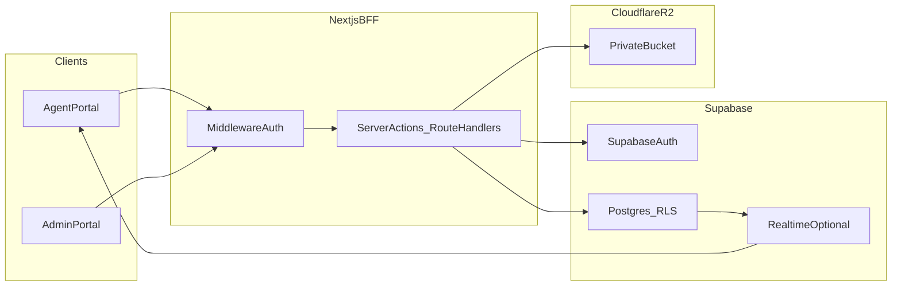
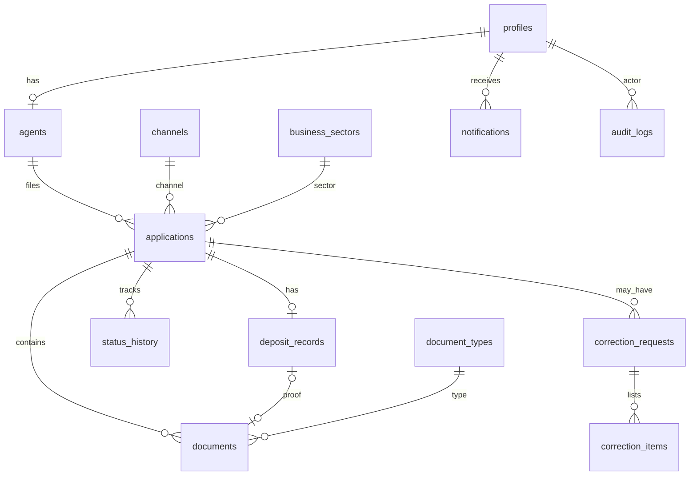
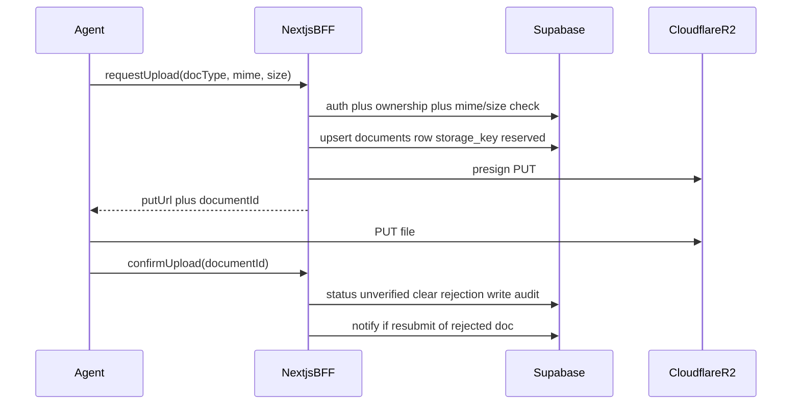
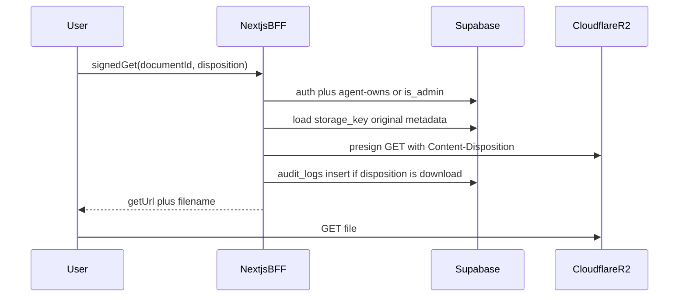

# Kinetic — Agent Application & Document Management Portal

**Implementation Plan — Version 1.3**  
Overview plus a production backend using **Next.js, TypeScript, Supabase Auth, PostgreSQL, private Supabase Storage, Server Actions, RLS, and Zod**. The existing UI is connected to `lib/actions/*` with demo fallback when env is unset.

| | |
|---|---|
| Product | Kinetic Agent Application & Document Management Portal |
| Frontend | Next.js 16 UI wired to server actions and workspace loaders |
| Backend | Supabase Auth + Postgres/RLS + private Storage; dual-mode demo until schema is applied |
| Source overview | `data/Agent_Application_Document_Management_Portal_Implementation_Plan-1-3a0fe6.docx` |

This document is the planning baseline for implementing a real backend behind the existing screens. It does **not** describe money movement, float transfer, or a live integration with the external/main registration system. Those remain future work.

---

## Table of contents

- [Part A — Product overview](#part-a--product-overview)
  - [1. Purpose](#1-purpose)
  - [2. Executive summary](#2-executive-summary)
  - [3. Project objectives](#3-project-objectives)
  - [4. MVP scope](#4-mvp-scope)
  - [5. User roles and permissions](#5-user-roles-and-permissions)
  - [6. Agent information specification](#6-agent-information-specification)
  - [7. Optional / additional information](#7-optional--additional-information)
  - [8. Document management specification](#8-document-management-specification)
  - [9. Application status workflow](#9-application-status-workflow)
  - [10. Deposit / TZS 100,000 requirement](#10-deposit--tzs-100000-requirement)
  - [11. Location and live coordinates](#11-location-and-live-coordinates)
  - [12. Admin workspace](#12-admin-workspace)
  - [13. Copy All Details](#13-copy-all-details)
  - [14. Website screen plan](#14-website-screen-plan)
  - [15. Recommended user experience](#15-recommended-user-experience)
  - [16. Security and privacy](#16-security-and-privacy)
  - [17. MVP acceptance criteria](#17-mvp-acceptance-criteria)
  - [18. Future expansion](#18-future-expansion)
  - [19. Current UI versus this plan](#19-current-ui-versus-this-plan)
- [Part B — Backend architecture](#part-b--backend-architecture)
- [Part C — Canonical schema](#part-c--canonical-schema)
- [Part D — Cloudflare R2](#part-d--cloudflare-r2)
- [Part E — Data flows mapped to screens](#part-e--data-flows-mapped-to-screens)
- [Part F — BFF API map and environment](#part-f--bff-api-map-and-environment)
- [Part G — Backend implementation phases](#part-g--backend-implementation-phases)
- [Part H — Repository backend (as implemented)](#part-h--repository-backend-as-implemented)
- [Part I — Cutover checklist](#part-i--cutover-checklist)

---

# Part A — Product overview

## 1. Purpose

A digital portal for collecting agent registration information and supporting documents, so administrators can review, track, download, and copy verified information before entering it into an **external/main system**.

Version 1 is a controlled **collection, review, and preparation** layer. It is not a replacement for the organisation’s primary registration system. The architecture must remain extensible for later agent services (secure float transfer, wallet, a mobile application) without implementing those products now.

## 2. Executive summary

The system is a web-based Agent Application & Document Management Portal. Immediate goals:

- Reduce physical traffic and repetitive manual collection of agent information.
- Let agents register, submit structured details, upload required documents, and monitor progress online.
- Give administrators a workspace to search applications, review information and documents, request corrections, change status, download files, and copy structured information for another system.

## 3. Project objectives

- Reduce queues and unnecessary physical visits during agent application.
- Standardize the information collected from every agent.
- Centralize application documents in a searchable administrative workspace.
- Provide transparent application status tracking.
- Allow administrators to review, download, and copy verified information efficiently.
- Maintain an audit trail of important application actions.
- Create a scalable technical foundation for future financial/float services.
- Use a responsive design that can later support a dedicated mobile application.

## 4. MVP scope

| Area | Version 1 scope |
|---|---|
| Authentication | Agent registration, login, logout, password reset, role-based access |
| Agent profile | Personal, contact, identity, business, and location information |
| Application | Create, save, submit, and track agent application |
| Documents | Upload, preview, download, and manage required/optional files |
| Location | Address fields plus map-based location and coordinates |
| Deposit | Required TZS 100,000 deposit field, status, and proof/reference |
| Admin | Dashboard, search, filters, review, status management, document access |
| Data transfer support | Copy individual fields or a formatted Copy All Details block |
| Audit | Application status history and key administrative actions |
| Future placeholders | Float transfer, transactions, wallet, notifications (realtime), analytics |

## 5. User roles and permissions

| Role | Main capabilities | V1 |
|---|---|---|
| **Agent** | Register, maintain profile, submit application, upload documents, view status, respond to corrections | Yes |
| **Admin / Reviewer** | View/search applications, review documents, change status, request corrections, download/copy data | Yes |
| **Super Admin** | Manage admins, system settings, audit access, configuration and reporting | Reserved in schema; not implemented |

Agents must only access their own applications and documents. Admins access the administrative workspace. Never rely only on hiding UI buttons.

## 6. Agent information specification

Core registration / application dataset:

| Field | Required? | Notes |
|---|---|---|
| Full name | Required | Structured first, middle, and surname if needed |
| Registered phone number | Required | Primary agent/channel phone; validate format and uniqueness |
| Email | Required | Account communication and recovery |
| Country | Required | Default operating country, editable if business rules permit |
| Province / region | Required | Cascading selection |
| District | Required | Cascading selection |
| Ward | Required | Cascading selection |
| Detailed location | Required | Street/village/area, landmark, or address description |
| Live coordinates | Recommended | Latitude and longitude via browser/device permission |
| Business sector | Required | Controlled dropdown |
| Channel name | Required | Controlled list of supported channels |
| ID type | Required | National ID, passport, driver’s licence, voter ID, etc. |
| ID number | Required | Validate format where rules are known |
| Issued place | Required | Place/authority where ID was issued |
| Gender | Required if operationally necessary | Controlled selection |
| TIN number | Required | Validate format where possible |
| Deposit amount | Required | Default/required amount: TZS 100,000 |
| Deposit status | Required | Pending / Submitted / Cleared (Verified) / Rejected / Awaiting Proof |
| Deposit proof / reference | Recommended | Upload receipt or enter transaction/reference number |
| Application status | System controlled | Draft / Submitted / Pending Review / In Progress / Needs Correction / Completed / Rejected |

## 7. Optional / additional information

| Field | Why it helps |
|---|---|
| Business licence | Supporting business verification |
| Contract number / date / valid date | Agreement linkage and expiry monitoring |
| Business / shop name | When different from the agent’s personal name |
| Alternative phone | Backup contact |
| Emergency / secondary contact | Operational communication |
| Agent / account number | External identifier if issued by the channel |
| Referral / recruitment agent | Who onboarded the agent |
| Notes / comments | Admin-only operational notes |
| Preferred communication method | Phone / SMS / Email / other |
| Document expiry dates | Future expiry reminders for ID / licence / contract |

## 8. Document management specification

| Document | Required? | System behaviour |
|---|---|---|
| ID card front | Required | Image/PDF upload, preview, download |
| ID card back | Required where applicable | Image/PDF upload, preview, download |
| TIN document | Required | Upload and link to TIN number |
| Agreement contract | Required | PDF preferred; record upload date |
| Shop image | Required | Image upload; optionally capture from device |
| Portrait / passport photo | Required | Image validation and preview |
| Business licence | Optional | Optional upload with expiry metadata |
| Other document | Optional | Multiple files with a document name/type |
| Deposit proof | Recommended | Receipt/screenshot/reference for the TZS 100,000 deposit |

Upload controls: accepted types (PDF, JPG, PNG), file-size limits, normalized filenames, **private storage** (never public URLs).

Canonical `document_type` codes used by the UI and the backend:

| Code | Label | Required to submit |
|---|---|---|
| `id_front` | ID Card Front | Yes |
| `id_back` | ID Card Back | Yes |
| `tin` | TIN Document | Yes |
| `portrait` | Portrait | Yes |
| `shop_image` | Shop Image | Yes |
| `contract` | Agreement Contract | Yes |
| `licence` | Business Licence | No |
| `other` | Other | No |
| `deposit_proof` | Deposit proof | Recommended; stored on `deposit_records`, not the required checklist |

Document statuses: `missing` | `unverified` | `verified` | `rejected`. Rejected documents carry a reviewer reason the agent can see.

## 9. Application status workflow

| Status | Meaning |
|---|---|
| `DRAFT` | Agent is filling the application; not yet submitted |
| `SUBMITTED` | Agent has submitted the application |
| `PENDING_REVIEW` | Waiting for administrator review |
| `IN_PROGRESS` | An administrator is actively reviewing/processing it |
| `NEEDS_CORRECTION` | Agent must correct information or replace a document |
| `COMPLETED` | Administrative processing is complete; ready to copy into the external system |
| `REJECTED` | Application cannot proceed; reason must be recorded |

**Deposit status is a separate machine.** An application can be `IN_PROGRESS` while the deposit is already `CLEARED`. Do not collapse financial/deposit state into application workflow.

Allowed application transitions (V1):

```
DRAFT → SUBMITTED → PENDING_REVIEW → IN_PROGRESS
                                    → NEEDS_CORRECTION → SUBMITTED   (agent resubmits)
                                    → COMPLETED
                                    → REJECTED
```

Admin review dropdown (already in the UI) omits `DRAFT` and `SUBMITTED`:  
`PENDING_REVIEW → IN_PROGRESS → NEEDS_CORRECTION → COMPLETED | REJECTED`.

On successful wizard submit, persist `SUBMITTED` then immediately move to `PENDING_REVIEW` (matches the current success copy: “pending review”). Keep both rows in `status_history`.

## 10. Deposit / TZS 100,000 requirement

The registered phone number is associated with the required TZS 100,000 deposit. The MVP records the requirement and evidence. It does **not** move money unless a later payment integration is approved.

| Field | Example |
|---|---|
| Required amount | TZS 100,000 |
| Deposit status | `PENDING` / `SUBMITTED` / `CLEARED` / `REJECTED` / `AWAITING_PROOF` |
| Payment / transaction reference | Entered by agent or admin |
| Proof | Receipt or transaction evidence in R2 |
| Verified by | Admin account |
| Verified at | Date/time |
| Verification note | Optional admin note |

`CLEARED` is the UI and backend name for the Word plan’s “Verified”.

## 11. Location and live coordinates

Combine administrative address fields with optional device-based coordinates. The agent must explicitly grant browser/device location permission before coordinates are captured.

| Location data | Implementation |
|---|---|
| Country | Dropdown |
| Province / region | Cascading dropdown |
| District | Cascading dropdown |
| Ward | Cascading dropdown |
| Detailed location | Free text (street, house number) |
| Latitude / longitude | Numeric |
| Location accuracy | Optional GPS/browser accuracy |
| Map preview | Display captured point |
| Capture timestamp | When coordinates were captured |

Exact coordinates are not public. Restrict them to the owning agent and authorized admins.

## 12. Admin workspace

Designed around fast review and data transfer:

- Dashboard cards: Total, Pending, In Progress, Needs Correction, Completed, Rejected.
- Search by application number, agent name, registered phone, ID number, TIN, or channel.
- Filters by status, channel, business sector, location, date range.
- Application review page with structured data and document previews.
- Document download with standardized filenames (`Name_Doc_Network.ext`).
- Copy individual fields and **Copy All Details**.
- Status controls with confirmation and optional review notes.
- Correction request that records what the agent must fix.
- Application timeline of who did what and when.

## 13. Copy All Details

Because V1 supports another/main system, a structured copy feature is in the MVP. It must not copy passwords or authentication secrets.

Example output:

```
Agent Name: [Name]
Registered Phone: [Phone]
Business Sector: [Sector]
Channel: [Channel]
ID Type: [Type]
ID Number: [Number]
TIN: [TIN]
Country: [Country]
Region: [Region]
District: [District]
Ward: [Ward]
Location: [Location]
Latitude: [Latitude]
Longitude: [Longitude]
```

## 14. Website screen plan

| Area | Screens |
|---|---|
| Public | Landing (optional), Login, Register |
| Agent | Dashboard, New Application, My Applications, Application Details, Documents, Profile, Notifications |
| Admin | Dashboard, Applications, Application Review, Agents, Documents, Reports, Activity / Audit |
| Future (nav placeholders) | Float Transfer, Transactions, Wallet, Agent Network, Financial Reports, Mobile App |

Current App Router map (already built as mock UI):

| Path | Role |
|---|---|
| `/login`, `/register` | Public |
| `/agent/dashboard`, `/agent/applications`, `/agent/applications/new`, `/agent/applications/[id]`, `/agent/documents`, `/agent/notifications`, `/agent/profile` | Agent |
| `/admin/dashboard`, `/admin/applications`, `/admin/applications/[id]`, `/admin/agents`, `/admin/documents`, `/admin/reports`, `/admin/activity` | Admin |

## 15. Recommended user experience

- Multi-step application form, not one long page.
- Required fields clearly marked; optional fields separate.
- Progress: Personal → Business → Identity → Location → Deposit → Documents → Review.
- Autosave drafts so an agent does not lose progress.
- Upload progress and document previews.
- Status badges with text, not colour alone.
- Admin review screen keyboard-friendly for repetitive work.
- Responsive from the start.
- Validation before submission; confirmation dialogs for reject / irreversible actions.

## 16. Security and privacy

- Server-side authorization; never rely only on hidden buttons.
- Agents access only their own applications and documents.
- Admins access administrative functions according to role.
- Uploaded documents in **private** storage; issue controlled access / download links.
- Validate file type, file size, and upload content where feasible.
- HTTPS in production.
- Never store plain-text passwords; use a trusted authentication provider (Supabase Auth).
- Protect ID numbers and TIN from unnecessary exposure.
- Audit document access, downloads, status changes, and administrative edits.
- Soft deletion or retention rules rather than uncontrolled permanent deletion.
- Do not expose live coordinates publicly.

## 17. MVP acceptance criteria

- An agent can register and securely log in.
- An agent can complete required personal, business, identity, and location information.
- An agent can capture or submit location coordinates with permission.
- An agent can upload all required documents and optional supporting documents.
- The system validates required fields before submission.
- The application receives a unique application number.
- The agent can view the current application status.
- An admin can search and filter applications.
- An admin can view authorized application details and documents.
- An admin can download documents.
- An admin can change application status with an audit trail.
- An admin can request corrections.
- An admin can copy individual details and all transferable application information.
- The system separately records the TZS 100,000 deposit status.
- Unauthorized users cannot access another agent’s data.
- The interface works on desktop and mobile screen sizes.

## 18. Future expansion

Reserved in navigation and schema, **not** built in V1:

- Secure agent-to-agent float transfer.
- Transaction history and reconciliation.
- Agent wallet / account dashboard.
- Channel / provider integrations.
- Real-time transfer notifications.
- Agent-to-agent network / directory.
- Advanced analytics.
- Automated document expiry reminders.
- Mobile app (React Native / Expo) against the same backend.
- API integration with the external/main registration system.

Final V1 loop:

**REGISTER → COMPLETE AGENT DETAILS → UPLOAD DOCUMENTS → SUBMIT → ADMIN REVIEW → CORRECTION IF NEEDED → IN PROGRESS → COMPLETED → COPY / DOWNLOAD → EXTERNAL SYSTEM**

## 19. Current UI versus this plan

The Next.js app is a working **mock**. There is no `app/api/`, no `.env`, no middleware, no Supabase/R2. Auth is `sessionStorage` (`lib/auth.ts`). Data lives in `lib/admin-data.ts` and `lib/agent-data.ts`. Files are public PNGs under `public/documents/`. Mutations are React state and reset on refresh.

Call these gaps out so the backend unifies them rather than shipping the prototype’s inconsistencies.

| Gap | Today | Target |
|---|---|---|
| Two agent identity models | Admin `Agent.id` is `"1"`…`"8"` / `AGT-492`; agent portal is `agent-amina` / `AG-2026-00842` | One `agents` row per user; applications FK `agent_id` |
| Join on display name | Admin sheet matches apps where `app.agentName === agent.name` (often fails) | Join on `agents.id` |
| Three channel taxonomies | Wizard: M-Pesa / Tigo Pesa / Airtel Money. Admin agents: Retail Partner / Direct Sales / Third-Party. Reports pie: Web Portal / USSD | `channels` = mobile-money brands; `agents.commercial_channel` = how they were recruited |
| Report sectors vs wizard sectors | Charts: Agriculture / Manufacturing; wizard: Retail Kiosk / Pharmacy | `business_sectors` from the wizard; reports aggregate those codes |
| Document checklists | Agent current app: 4 docs. Wizard: 6. Admin cases: 8 | Required six types listed in §8; licence/other optional; deposit proof on `deposit_records` |
| Deposit “Verified” vs `CLEARED` | Word plan says Verified; UI uses `CLEARED` | Keep `CLEARED` as the stored value |
| `DRAFT` never persisted | Type + badge only; wizard submit is a timeout | Autosave `DRAFT`; submit allocates `application_number` |
| Correction notes discarded | Admin dialog sets `NEEDS_CORRECTION` and drops the note | `correction_requests` + `correction_items` |
| Auth is client-only | `AuthGuard` + demo passwords on screen | Supabase Auth cookies + middleware; agents cannot hit `/admin/*` |
| Agent logout bug | Agent sidebar `router.push("/login")` does not `clearSession()` | Real logout revokes session |
| Unread badge | Reads module constant, not list state | `notifications.read_at` |
| Hardcoded dashboard numbers | `totalApps: 1482` etc. | SQL aggregates |
| Public file URLs | `/documents/*.png` | Private R2 + short-lived signed GET |
| No server authorization | Anyone with the JS bundle can see admin routes | RLS + BFF checks |

---

# Part B — Backend architecture

## B.1 Recommended runtime (V1)



| Layer | Technology | Purpose |
|---|---|---|
| Frontend | Next.js 16 App Router + TypeScript (existing) | Agent and admin screens |
| UI | Tailwind CSS + existing shadcn components | Consistent interface |
| BFF | Next.js Server Actions and/or Route Handlers | Business rules, R2 signing, authorization |
| Auth | Supabase Auth via `@supabase/ssr` | Email/password, reset, httpOnly cookies |
| Database | Supabase PostgreSQL + RLS | Users, agents, applications, metadata |
| Files | Cloudflare R2 (S3-compatible, private bucket) | Documents and deposit proofs |
| Maps | Browser Geolocation API + map provider | Coordinates and preview |
| Deploy | Vercel (or equivalent) + Supabase + R2 | Production hosting |

## B.2 Decisions

1. **Next.js is the only process that talks to R2.** Access keys never reach the browser. The client receives short-lived presigned PUT/GET URLs.
2. **Postgres holds metadata; R2 holds blobs.** The join is `documents.storage_key` (and deposit proof on `deposit_records`).
3. **Supabase Auth replaces `sessionStorage` once env is set.** Until then, demo accounts still work. Next.js 16 uses **`proxy.ts`** (not deprecated `middleware.ts`) to refresh cookies and gate `/agent/*` and `/admin/*`. `components/auth/auth-guard.tsx` remains a UX shell.
4. **RLS is defense in depth.** Even though mutations go through the BFF, policies still prevent a leaked anon key from reading another agent’s rows.
5. **V1 roles:** `agent` and `admin`. Enum includes `super_admin` but no UI or grants in V1.
6. **Application status and deposit status stay independent.**
7. **No money movement and no external registrar API in V1.** Copy All Details + signed downloads remain the transfer path.
8. **Replace mock modules, keep TypeScript shapes.** Pages should keep talking to types close to `Application`, `Document`, `AgentProfile`, `AuditLogEntry` in `lib/admin-data.ts` / `lib/agent-data.ts`, backed by a real data-access layer instead of in-memory arrays.
9. **Realtime is optional.** In-app `notifications` table is required; Supabase Realtime can push new rows later without changing the schema.

## B.3 Trust boundary

| Can run in the browser | Must stay on the server |
|---|---|
| Supabase anon key + user JWT (via cookies) | `SUPABASE_SERVICE_ROLE_KEY` |
| Presigned PUT/GET URLs (seconds TTL) | R2 access key + secret |
| Form state, file picker, previews | Status machine, duplicate checks, filename policy |

Use the **user-scoped Supabase client** (JWT + RLS) for normal reads/writes. Use the service role only for jobs that must bypass RLS (e.g. generating sequential `APP-YYYY-NNNN` if a privileged function is required). Prefer a Postgres function with `SECURITY DEFINER` over sprinkling the service role through route handlers.

---

# Part C — Canonical schema

## C.1 Entity relationship



Identity chain (unifies today’s three agent IDs):

`auth.users.id` = `profiles.id` → `agents.user_id` → `applications.agent_id`

## C.2 Enums

```sql
create type user_role as enum ('agent', 'admin', 'super_admin');
create type agent_lifecycle as enum ('pending', 'active', 'suspended');
create type commercial_channel as enum ('retail_partner', 'direct_sales', 'third_party');
create type app_status as enum (
  'DRAFT', 'SUBMITTED', 'PENDING_REVIEW', 'IN_PROGRESS',
  'NEEDS_CORRECTION', 'COMPLETED', 'REJECTED'
);
create type deposit_status as enum (
  'PENDING', 'SUBMITTED', 'CLEARED', 'REJECTED', 'AWAITING_PROOF'
);
create type document_status as enum ('missing', 'unverified', 'verified', 'rejected');
create type notification_category as enum ('application', 'document', 'deposit', 'system');
create type audit_category as enum ('Application', 'Document', 'Agent', 'System', 'Security');
create type audit_severity as enum ('info', 'warning', 'critical');
```

## C.3 Tables

### `profiles`

Maps 1:1 to `auth.users`. Created by a trigger on signup.

| Column | Type | Notes |
|---|---|---|
| `id` | uuid PK | `= auth.users.id` |
| `role` | `user_role` | default `agent` |
| `full_name` | text | |
| `email` | text | unique, from Auth |
| `phone` | text | unique where not null |
| `title` | text | e.g. Registered Agent / Super Administrator |
| `initials` | text | UI avatar |
| `created_at` / `updated_at` | timestamptz | |

### `agents`

| Column | Type | Notes |
|---|---|---|
| `id` | uuid PK | |
| `user_id` | uuid unique FK → profiles | |
| `agent_code` | text unique | e.g. `AG-2026-00842`; assigned after first submit or on activation |
| `status` | `agent_lifecycle` | `pending` until first completed/approved policy |
| `commercial_channel` | `commercial_channel` | recruitment type (admin agents table) |
| `verified` | boolean | agent portal badge |
| `member_since` | date | |
| `created_at` / `updated_at` | timestamptz | |

### `channels`

Mobile-money / product channel (wizard dropdown). Seed: M-Pesa, Tigo Pesa, Airtel Money.

| Column | Type |
|---|---|
| `id` | uuid PK |
| `name` | text |
| `code` | text unique |
| `active` | boolean |

### `business_sectors`

Wizard sectors, not the mock report pie. Seed: Retail Kiosk, Supermarket, Pharmacy, Wholesale.

| Column | Type |
|---|---|
| `id` | uuid PK |
| `name` | text |
| `code` | text unique |
| `active` | boolean |

### `document_types`

| Column | Type | Notes |
|---|---|---|
| `code` | text PK | `id_front`, `id_back`, … |
| `name` | text | Display label |
| `required` | boolean | Required to **submit** |
| `allowed_mime` | text[] | e.g. `{image/jpeg,image/png,application/pdf}` |
| `max_size_bytes` | integer | e.g. 10 MiB |
| `sort_order` | integer | Checklist order |

Do **not** put `deposit_proof` in the required application checklist. Seed it as `required = false` and attach it through `deposit_records.proof_document_id`.

### `applications`

Denormalized snapshot of submitted details so a later profile edit does not rewrite a case already in review. V1: one **active** (non-rejected) application per agent is enough; historically keep completed/rejected rows.

| Column | Type | Notes |
|---|---|---|
| `id` | uuid PK | |
| `agent_id` | uuid FK → agents | **not** join on name |
| `application_number` | text unique | `APP-YYYY-NNNN`; null while `DRAFT` |
| `status` | `app_status` | |
| `channel_id` | uuid FK → channels | |
| `sector_id` | uuid FK → business_sectors | |
| `business_name` | text | |
| `phone` / `email` | text | snapshot |
| `id_type` / `id_number` | text | |
| `issued_place` / `issued_date` / `expire_date` | text / date | |
| `gender` | text | |
| `country` / `province` / `district` / `ward` / `street` / `house_number` | text | |
| `lat` / `lng` | numeric | nullable |
| `location_accuracy` | numeric | optional |
| `location_captured_at` | timestamptz | |
| `channel_parent_type` / `channel_parent_name` | text | declaration |
| `channel_manager_type` / `channel_manager_name` | text | |
| `channel_type` | text | e.g. Retail Kiosk |
| `tin_number` | text | |
| `notes` | text | agent-facing notes at submit |
| `admin_notes` | text | admin-only; never returned on agent queries |
| `fields_complete` / `fields_total` | integer | computed at save/submit |
| `submitted_at` / `reviewed_at` / `completed_at` | timestamptz | |
| `rejection_reason` | text | required when `REJECTED` |
| `created_at` / `updated_at` | timestamptz | |

Partial unique index (decided): at most one row per agent where `deleted_at is null` and `status` not in (`COMPLETED`, `REJECTED`). Snapshot `agent_name` on the application so later profile edits do not rewrite a case in review.

### `documents`

| Column | Type | Notes |
|---|---|---|
| `id` | uuid PK | |
| `application_id` | uuid FK | |
| `document_type` | text FK → document_types | |
| `status` | `document_status` | default `missing` |
| `storage_key` | text unique | R2 object key; null if missing |
| `original_name` | text | |
| `mime_type` | text | |
| `file_size` | bigint | |
| `file_extension` | text | `png`, `jpg`, `pdf` |
| `rejection_reason` | text | shown to agent |
| `verified_by` | uuid FK → profiles | |
| `verified_at` | timestamptz | |
| `uploaded_at` | timestamptz | |
| `created_at` / `updated_at` | timestamptz | |

On application create, insert a stub row per required (and optional) type with `status = missing`. Uploads upsert the same row rather than stacking anonymous files (except `other`, which may have many rows).

### `deposit_records`

One per application.

| Column | Type | Notes |
|---|---|---|
| `id` | uuid PK | |
| `application_id` | uuid unique FK | |
| `amount` | numeric | default `100000` |
| `currency` | text | default `TZS` |
| `status` | `deposit_status` | |
| `reference` | text | |
| `proof_document_id` | uuid FK → documents | optional |
| `verified_by` | uuid FK → profiles | |
| `verified_at` | timestamptz | |
| `verification_note` | text | |
| `created_at` / `updated_at` | timestamptz | |

### `status_history`

| Column | Type |
|---|---|
| `id` | uuid PK |
| `application_id` | uuid FK |
| `old_status` | `app_status` null on create |
| `new_status` | `app_status` |
| `changed_by` | uuid FK → profiles |
| `note` | text |
| `created_at` | timestamptz |

This table is the source of the application **timeline** (plus document verify events and deposit verify events, which can be stored as timeline rows or derived from audit). Prefer writing timeline-quality messages into `status_history.note` / `audit_logs` rather than storing relative strings like `"2 hours ago"`.

### `correction_requests` and `correction_items`

| `correction_requests` | Type |
|---|---|
| `id` | uuid PK |
| `application_id` | uuid FK |
| `requested_by` | uuid FK → profiles |
| `summary` | text |
| `resolved_at` | timestamptz |
| `created_at` | timestamptz |

| `correction_items` | Type |
|---|---|
| `id` | uuid PK |
| `correction_request_id` | uuid FK |
| `kind` | text (`field` \| `document`) |
| `target` | text | field name or `document_type` |
| `reason` | text |
| `resolved_at` | timestamptz |

Rejecting a document should upsert an open correction item for that `document_type`.

### `notifications`

| Column | Type |
|---|---|
| `id` | uuid PK |
| `user_id` | uuid FK → profiles |
| `category` | `notification_category` |
| `title` | text |
| `message` | text |
| `entity_type` / `entity_id` | text / uuid | optional deep-link |
| `read_at` | timestamptz |
| `created_at` | timestamptz |

Unread count = `where user_id = auth.uid() and read_at is null`.

### `audit_logs`

| Column | Type | Notes |
|---|---|---|
| `id` | uuid PK | |
| `actor_id` | uuid FK → profiles | null for `System` |
| `actor_role` | text | denormalized for display |
| `category` | `audit_category` | |
| `severity` | `audit_severity` | |
| `action` | text | |
| `detail` | text | |
| `entity_type` / `entity_id` | text / uuid | |
| `target` | text | display label e.g. `APP-2023-8942` |
| `ip_address` | inet | from request headers |
| `metadata` | jsonb | |
| `created_at` | timestamptz | |

Append-only. No updates from the app. RLS: admins select; agents cannot.

## C.4 Helper views / derived data

**Case health** stays a **derived** function (same rules as `computeCaseHealth` in `lib/admin-data.ts`), not a stored column. Compute from documents + fields + deposit + application status. Store `fields_complete` / `fields_total` on the application at each save so the dashboard does not re-walk every form field.

**Days pending** = `now() - submitted_at` (or last return to `PENDING_REVIEW`), not a stored integer.

## C.5 Row Level Security (summary)

| Table | Agent | Admin |
|---|---|---|
| `profiles` | select/update own row | select all |
| `agents` | select/update own row | select all; update status |
| `applications` | select/insert/update **own** (`DRAFT` / `NEEDS_CORRECTION` fields) | select/update all |
| `documents` | select own; update via BFF after upload | select all; verify/reject |
| `deposit_records` | select own; update reference/proof while draft or correction | select all; verify |
| `notifications` | select/update own (`read_at`) | select all |
| `audit_logs` / `status_history` | agent: select own application history | select all; insert via BFF |
| Lookups | select active | select all |

Policy helper: `is_admin()` = `exists (select 1 from profiles p where p.id = auth.uid() and p.role in ('admin','super_admin'))`.

Ownership: `applications.agent_id` in (`select id from agents where user_id = auth.uid()`).

Agents **cannot** set `status` to `COMPLETED` / `REJECTED` / `IN_PROGRESS` / `PENDING_REVIEW`. Submit is a BFF action that calls a Postgres function `submit_application(id)` which checks required docs/fields and writes `SUBMITTED` then `PENDING_REVIEW`.

---

# Part D — Cloudflare R2

## D.1 Bucket policy

- One private bucket (e.g. `kinetic-agent-docs`).
- **No public access**, no public development URL used by the app.
- CORS: allow PUT from the Vercel / localhost origins so the browser can upload directly with the presigned URL.
- Server credentials: R2 S3 API token with `PutObject`, `GetObject`, `DeleteObject` (optional; prefer overwrite in place + orphan GC later).

## D.2 Object key convention

```
agents/{agent_id}/applications/{application_id}/{document_type}/{uuid}.{ext}
```

Example:

```
agents/7c2e…/applications/a91b…/id_front/3f0c9a12.png
```

Rules:

- `{uuid}` is a new object on each replace so old versions can be garbage-collected after confirm.
- `{ext}` is a normalized allow-list: `jpg`, `jpeg`, `png`, `pdf`.
- Never put PII (name, ID number) in the key.
- `deposit_proof` uses the same layout with `document_type = deposit_proof`.

Download **filename** (Content-Disposition) is not the object key. It uses the existing `buildDocumentFileName` helper in `lib/admin-data.ts`:

`{AgentName}_{DocName}_{Network}.{ext}`  
e.g. `MwakalingaMobileMoneyKiosk_IDCardFront_MPesa.png`.

## D.3 Presigned URL rules

| Operation | TTL | Who |
|---|---|---|
| PUT (upload / replace) | 2–5 minutes | Owning agent (and admin only if V1 later allows admin upload — **no** in V1) |
| GET (preview) | 5–10 minutes | Owning agent + any admin |
| GET (download) | 5 minutes | Same; `Content-Disposition: attachment; filename="…"` |

Do not persist `previewUrl` / `fileUrl` as public paths. The API returns a fresh signed URL when a screen opens a preview.

## D.4 Upload sequence



BFF checks before signing PUT:

1. Session present; role `agent`; application belongs to caller.
2. Application status is `DRAFT` or `NEEDS_CORRECTION` (or `SUBMITTED`/`PENDING_REVIEW` only for documents not yet locked — V1: allow replace until `IN_PROGRESS` unless that doc is already `verified`, then require correction status).
3. `mime` and `size` match `document_types`.
4. Reserve `storage_key`; return the URL bound to **that exact key** and content-type.

On `confirmUpload`, optionally `HeadObject` to verify the object exists and size matches. Then set `status = unverified`, clear `rejection_reason` if this was a replacement, `uploaded_at = now()`.

If the previous object key differs, enqueue deletion of the old key (or delete immediately).

## D.5 Download / preview sequence



Replace `lib/download.ts` fetching `/documents/*.png` with: call `documents.signedGet`, then `downloadFile(getUrl, filename)`.

Audit **downloads** and **status changes**. Previews can be logged at `info` or skipped to reduce noise; the plan requires auditing downloads.

## D.6 Replace `public/documents`

After R2 is wired:

- Stop using `public/documents/*.png` as live document URLs.
- Seed environments may still upload sample objects into R2, or keep fixtures only for Storybook/screenshot tests.

---

# Part E — Data flows mapped to screens

Each flow: actor → screens → writes → R2 → audit / notifications.

## E.1 Register, login, logout, password reset

| | |
|---|---|
| **Actor** | Public → new or existing user |
| **Screens** | `/register`, `/login` |
| **Writes** | Supabase Auth `signUp` / `signIn`; trigger inserts `profiles` (role `agent`) and `agents` (`status = pending`). Login reads `profiles.role` and redirects `/agent/dashboard` or `/admin/dashboard`. |
| **R2** | None |
| **Audit** | `Security` / login success and failed attempts |
| **Notifications** | Optional welcome (`system`) |

Admin users are **not** created from `/register`. Seed or invite them in Supabase (dashboard or SQL).

Middleware (new `middleware.ts`):

- No session + `/agent/*` or `/admin/*` → `/login`
- Role `agent` + `/admin/*` → `/agent/dashboard`
- Role `admin` + `/agent/*` → `/admin/dashboard`

This **replaces `AuthGuard` as the real gate**. Keep the client guard for loading states.

Logout: `supabase.auth.signOut()` then `/login` (fixes the agent sidebar bug that only `router.push`s).

Password reset: Supabase email reset; `/login` “Forgot password?” currently `href="#"` gets a real route later (`/forgot-password`).

## E.2 Draft wizard autosave

| | |
|---|---|
| **Actor** | Agent |
| **Screens** | `/agent/applications/new` (and detail if returned to draft) |
| **Writes** | Ensure one open application; `INSERT` if none; `PATCH` fields; `status = DRAFT`; recompute `fields_complete` / `fields_total`. Create stub `documents` + empty `deposit_records`. |
| **R2** | None until document steps call `requestUpload` |
| **Audit** | Optional; do not spam. First create only. |
| **Notifications** | None |

Wizard `FormState` maps to `applications` columns: `fullName, phone, email, idType, idNumber, gender, businessName, sector, channel, province, district, street, depositReference, notes` plus the rest of `Application` (ward, houseNumber, lat/lng, issuedPlace/dates, channel parent/manager).

## E.3 Submit

| | |
|---|---|
| **Actor** | Agent |
| **Screens** | Wizard step Review & Submit |
| **Writes** | Transaction: validate required fields + required document types not `missing`/`rejected` + deposit `reference` or proof. Allocate `application_number`. Set `SUBMITTED` + `submitted_at`, then `PENDING_REVIEW`. Two `status_history` rows. |
| **R2** | None (files already uploaded) |
| **Audit** | Application created / submitted |
| **Notifications** | Agent: “Application submitted / pending review”. Optional: all admins not required in V1. |

Duplicate **warnings** (do not hard-block until policy is confirmed): same `phone`, `id_number`, or `tin_number` on another non-rejected application. Return warnings to the UI; admin review should surface them.

## E.4 Agent documents manager

| | |
|---|---|
| **Actor** | Agent |
| **Screens** | `/agent/documents`, wizard Documents step |
| **Writes** | `requestUpload` / `confirmUpload`; replace sets `unverified` and clears previous rejection. |
| **R2** | Presigned PUT |
| **Audit** | Document uploaded / replaced |
| **Notifications** | None on first upload; on re-upload after reject, notify is optional |

Rejected docs show `rejection_reason`. Preview uses `signedGet` (today’s Preview button has no `onClick` — wire it).

## E.5 Admin review and status

| | |
|---|---|
| **Actor** | Admin |
| **Screens** | `/admin/applications`, `/admin/applications/[id]` (`application-review.tsx`) |
| **Writes** | `updateStatus` with allowed transitions; Approve → `COMPLETED` + `completed_at`; Reject requires `rejection_reason`; Request Correction writes `correction_requests` + items and sets `NEEDS_CORRECTION` (**do not discard the note**). |
| **R2** | Signed GET for previews |
| **Audit** | Status change, correction requested |
| **Notifications** | Agent: status change, correction requested with checklist |

Copy All Details is a **read** of the same payload as `export.copyAllPayload` (no extra table). Print/Share remain out of V1 backend scope if still unimplemented in UI.

## E.6 Document verify / reject

| | |
|---|---|
| **Actor** | Admin |
| **Screens** | Application review pane, `/admin/documents` sheet |
| **Writes** | `verify`: `verified`, `verified_by`, `verified_at`. `reject`: `rejected` + reason; upsert `correction_items`. Admin `/admin/documents` must persist to the same row as the case file (today it only mutates sheet local state). |
| **R2** | Signed GET for preview |
| **Audit** | Document verified / rejected |
| **Notifications** | Agent on reject |

OCR remains **simulated** in V1 (no real OCR pipeline). `verified_by` is always a `profiles` id, never the string `"System OCR"` unless a future job user is seeded.

## E.7 Deposit verify

| | |
|---|---|
| **Actor** | Agent (reference + proof) / Admin (verify) |
| **Screens** | Wizard Deposit step, application detail, admin review |
| **Writes** | Agent: `deposits.upsert` (`SUBMITTED` or `AWAITING_PROOF`). Admin: `deposits.verify` → `CLEARED` or `REJECTED`. Independent of `applications.status`. |
| **R2** | Proof upload same as documents |
| **Audit** | Deposit verified / rejected |
| **Notifications** | Agent on clear or reject |

Word plan “Verified” = stored `CLEARED`.

## E.8 Notifications

| | |
|---|---|
| **Actor** | System (written by BFF) / Agent (read) |
| **Screens** | `/agent/notifications`, badges on sidebar/topbar |
| **Writes** | Insert on: submit, status change, document reject, deposit clear/reject, correction request. `markRead` / `markAllRead` sets `read_at`. |
| **R2** | None |
| **Audit** | None |
| **Unread** | Query `read_at is null` — not a module constant |

Optional later: Supabase Realtime on `notifications` for the current `user_id`.

## E.9 Reports and dashboards

| | |
|---|---|
| **Actor** | Admin; agent dashboard is the current user’s case |
| **Screens** | `/admin/dashboard`, `/admin/reports`, `/agent/dashboard` |
| **Writes** | None (reads) |
| **Source** | SQL aggregates over `applications` / `documents` / `deposit_records`, grouped by `business_sectors.name` and `channels.name` — **not** `dashboardStats`, `monthlyVolume`, or the Agriculture pie |

Admin dashboard “Needs Attention”: `PENDING_REVIEW` or `NEEDS_CORRECTION` (and optionally expire-soon IDs: `expire_date < now() + 90 days`).

Agent dashboard: `computeCaseHealth(currentApplication)` server-side.

## E.10 Duplicate detection

On submit (and optionally on draft save of ID/phone/TIN):

```sql
-- conceptual
select application_number from applications a
join agents ag on ag.id = a.agent_id
where a.status not in ('REJECTED')
  and (a.phone = :phone or a.id_number = :id or a.tin_number = :tin)
  and a.id <> :current_id
```

Return `{ duplicates: [...] }` to the client. V1 **warns**. Hard unique indexes can be added once operations confirm they want to block.

## E.11 Agents directory and profile

| | |
|---|---|
| **Admin** `/admin/agents` | `agents.list` with search/filter; sheet uses `agent_id` FK apps, never name match |
| **Agent** `/agent/profile` | `agents.updateProfile` for `full_name`, `email`, `phone` (email change goes through Auth). `agent_code`, role, `member_since` read-only |

Admin suspend/activate: `agents.setStatus` → `suspended` / `active` + audit. No new “create agent” form in V1 (agents self-register).

---

# Part F — BFF API map and environment

Names are **logical**. Implement as Server Actions (`lib/actions/*.ts`) and/or `app/api/**/route.ts`. Keep a typed client in `lib/api/` so pages do not import Supabase or R2 directly.

## F.1 Actions

### `auth`

| Action | Auth | Behaviour |
|---|---|---|
| `auth.session` | cookie | Current `SessionUser`-shaped profile + role |
| `auth.signIn` | public | Email/password |
| `auth.signUp` | public | Creates Auth user + profile + agent |
| `auth.signOut` | session | |
| `auth.requestPasswordReset` | public | |

### `applications`

| Action | Role | Behaviour |
|---|---|---|
| `applications.list` | agent: own; admin: filtered | Search/filter/pagination |
| `applications.get` | owner or admin | Full case + signed preview URLs |
| `applications.saveDraft` | agent | PATCH while `DRAFT` / correction-allowed fields |
| `applications.submit` | agent | Validate, number, `SUBMITTED` → `PENDING_REVIEW` |
| `applications.updateStatus` | admin | Allowed graph + history + notify |
| `applications.requestCorrection` | admin | Summary + items; `NEEDS_CORRECTION` |
| `applications.resubmit` | agent | From `NEEDS_CORRECTION` back through submit checks |

### `documents`

| Action | Role | Behaviour |
|---|---|---|
| `documents.requestUpload` | agent | Presign PUT |
| `documents.confirm` | agent | Mark `unverified` |
| `documents.verify` | admin | |
| `documents.reject` | admin | Reason required |
| `documents.signedGet` | owner or admin | Presign GET; audit if download |

### `deposits`

| Action | Role | Behaviour |
|---|---|---|
| `deposits.upsert` | agent | Reference + optional proof |
| `deposits.verify` | admin | `CLEARED` / `REJECTED` + note |

### `agents`

| Action | Role | Behaviour |
|---|---|---|
| `agents.list` | admin | Directory |
| `agents.get` | owner or admin | |
| `agents.updateProfile` | agent (own) | |
| `agents.setStatus` | admin | `pending` / `active` / `suspended` |

### `notifications`

| Action | Role |
|---|---|
| `notifications.list` | agent (own); admin optional |
| `notifications.markRead` | owner |
| `notifications.markAllRead` | owner |

### `reports`

| Action | Role |
|---|---|
| `reports.dashboard` | admin |
| `reports.volume` | admin | monthly submitted / in-review / completed / rejected |
| `reports.breakdowns` | admin | by sector and channel |

### `audit`

| Action | Role |
|---|---|
| `audit.list` | admin | Filters matching `/admin/activity` |

### `export`

| Action | Role | Behaviour |
|---|---|---|
| `export.copyAllPayload` | admin | Plain-text block; no secrets |
| `export.csv` | admin | Application list export (the current Export button has no handler) |

## F.2 Environment variables

Document in README when implementation starts. **Do not commit secrets.**

| Variable | Where | Purpose |
|---|---|---|
| `NEXT_PUBLIC_SUPABASE_URL` | Public | Project URL |
| `NEXT_PUBLIC_SUPABASE_ANON_KEY` | Public | RLS-constrained client |
| `SUPABASE_SERVICE_ROLE_KEY` | Server only | Privileged jobs if unavoidable |
| `R2_ACCOUNT_ID` | Server | Cloudflare account |
| `R2_ACCESS_KEY_ID` | Server | S3 API token |
| `R2_SECRET_ACCESS_KEY` | Server | S3 API secret |
| `R2_BUCKET` | Server | Bucket name |
| `R2_ENDPOINT` | Server | `https://{accountid}.r2.cloudflarestorage.com` |
| `R2_REGION` | Server | `auto` (AWS SDK) |
| `NEXT_PUBLIC_SITE_URL` | Public | Origin used for password-reset redirects |

Optional: `NEXT_PUBLIC_MAPS_KEY` when map preview is wired.

## F.3 Packages

Installed in the app:

- `@supabase/ssr`, `@supabase/supabase-js`
- `@aws-sdk/client-s3`, `@aws-sdk/s3-request-presigner` (R2 is S3-compatible)

## F.4 Mapping from mock files to the data layer

| Today | After / now |
|---|---|
| `lib/auth.ts` demo accounts + `sessionStorage` | Dual-mode: demo until env is set; then Supabase cookies + `profiles` |
| `lib/auth-context.tsx` | Calls `lib/actions/auth` when `NEXT_PUBLIC_SUPABASE_*` is present |
| `lib/admin-data.ts` arrays | Keep types + `computeCaseHealth` / `buildDocumentFileName`; lists come from `lib/actions/applications` (page switch still pending) |
| `lib/agent-data.ts` | Same; `getOwnAgent` + `listNotifications` are ready |
| `lib/download.ts` | Use `documents.signedGet` once document screens are wired |
| `components/auth/auth-guard.tsx` | UX only; `proxy.ts` enforces when backend is on |
| `public/documents/*` | R2 objects via `lib/r2/*` |
| `middleware.ts` (plan v1.1) | **`proxy.ts`** — Next.js 16 renamed the convention |

---

# Part G — Backend implementation phases

Repo-shaped cut of the Word plan Phases 1–8. Frontend screens already exist; each phase replaces mock data and wires persistence.

### Phase 1 — Foundation

- Supabase project, R2 bucket (private + CORS).
- SQL: enums, tables, indexes, RLS, `is_admin()`, signup trigger (`profiles` + `agents`).
- Seed `channels`, `business_sectors`, `document_types`.
- Next.js env, `@supabase/ssr` clients (browser, server, proxy).
- **`proxy.ts` role gates** (Next.js 16; do not add `middleware.ts`).
- Dual-mode: if public Supabase env is missing, skip proxy redirects and keep demo login.

### Phase 2 — Authentication and profile

- Replace demo login/register with Auth.
- Password reset route.
- `/agent/profile` and admin session chrome read from `profiles`.
- Seed one admin user for Kinetic (remove on-screen demo passwords).

### Phase 3 — Application module

- `saveDraft` / `submit` / `get` / `list` (agent).
- Unique `application_number`.
- Status history on every transition.
- Duplicate warnings.
- Agent applications list is no longer hardcoded to one `currentApplication`; detail is not 404 except for real missing/unauthorized ids.

### Phase 4 — Documents and R2

- Presigned PUT/GET.
- Confirm upload, replace, mime/size limits.
- Standardized download filename.
- Remove dependence on `public/documents` for live data.
- Wire preview buttons.

### Phase 5 — Admin portal

- Admin list/search/filter from SQL.
- Review: persist status, verify/reject, correction checklist (keep the note).
- Agents directory joined by `agent_id`.
- Documents repo reads the same `documents` table as the case file.

### Phase 6 — Data transfer

- `export.copyAllPayload` (existing Copy All UI).
- `export.csv` for the applications table Export button.
- Optional zip of signed downloads later; not required to close V1.

### Phase 7 — Audit and notifications

- Append-only `audit_logs` from BFF (status, download, verify, login).
- Timeline from `status_history` + selected audits.
- `notifications` insert + mark-read; sidebar badge from live count.

### Phase 8 — Production hardening

- Permission tests (agent cannot read another agent’s application or R2 key).
- Backups (Supabase PITR; R2 versioning or replication policy).
- Monitoring, rate limits on upload signing.
- Security review of RLS and service-role usage.
- Soft delete / retention for applications and objects.

### Phase 9 — Future (out of V1)

- Float, wallet, transactions, agent network, mobile client, external registrar API.

---

## Appendix A — Required versus optional documents (submit gate)

Must not be `missing` or `rejected`:

`id_front`, `id_back`, `tin`, `portrait`, `shop_image`, `contract`

Optional: `licence`, `other`  
Deposit: reference **or** `deposit_proof` (recommended both)

## Appendix B — Source artifacts

| Artifact | Role |
|---|---|
| `data/Agent_Application_Document_Management_Portal_Implementation_Plan-1-3a0fe6.docx` | Original Version 1.0 overview |
| `data/Agent_Application_Document_Management_Portal_Implementation_Plan-1-3ff57b.docx` | Duplicate copy of the same overview |
| This file | Overview + Supabase/R2 backend data-flow plan (v1.2) |
| `supabase/migrations/20260817120000_init.sql` | Canonical schema, RLS, RPCs |
| `supabase/seed.sql` | Channels, sectors, document types |
| `lib/admin-data.ts`, `lib/agent-data.ts`, `lib/auth.ts` | UI types + mock fallback |

---

# Part H — Repository backend (as implemented)

## H.1 Dual-mode

| Condition | Behaviour |
|---|---|
| `NEXT_PUBLIC_SUPABASE_URL` + `NEXT_PUBLIC_SUPABASE_ANON_KEY` **unset** | Demo login (`sessionStorage`), `AuthGuard` only, `proxy.ts` is a no-op. Admin/agent screens still use `lib/admin-data.ts` / `lib/agent-data.ts`. |
| Public Supabase env **set** | `lib/actions/auth` + cookie session. `proxy.ts` redirects unauthenticated `/agent` and `/admin` visitors to `/login`. Role is read from `auth.users.raw_app_meta_data.role` (synced from `profiles.role`). |
| R2 env **unset** | Auth/SQL still work; `documents.requestUpload` / `signedGet` return a configuration error until R2 is filled in. |

Demo passwords on `/login` are hidden once backend mode is on.

## H.2 File map

```
supabase/migrations/20260817120000_init.sql
supabase/seed.sql
.env.example
proxy.ts                          # Next.js 16 session refresh + role gates
lib/backend/env.ts
lib/backend/database.types.ts
lib/backend/errors.ts
lib/backend/session.ts
lib/backend/status.ts             # admin transition graph + field counts
lib/backend/mappers.ts            # DB rows → Application / notifications / audit
lib/supabase/client.ts
lib/supabase/server.ts
lib/supabase/proxy.ts
lib/r2/client.ts
lib/r2/presign.ts
lib/actions/auth.ts
lib/actions/applications.ts
lib/actions/documents.ts
lib/actions/deposits.ts
lib/actions/agents.ts
lib/actions/notifications.ts
lib/actions/reports.ts
lib/actions/audit.ts
lib/actions/export.ts
app/forgot-password/page.tsx
```

Server action names match Part F (`saveDraft`, `submitApplication`, `requestUpload`, `verifyDeposit`, `copyAllPayload`, …).

## H.3 Schema decisions locked in SQL

- Signup trigger always creates `profiles.role = 'agent'` + an `agents` row. **Never** take role from user metadata (prevents privilege escalation).
- Promote an admin after Auth user exists:

```sql
update public.profiles
   set role = 'admin',
       title = 'Super Administrator',
       initials = 'AU'
 where email = 'admin@kinetic.co.tz';
```

That update copies `role` into `raw_app_meta_data` so `proxy.ts` can gate without an extra query.

- One open application per agent (`COMPLETED`/`REJECTED` exempt).
- One document row per type except `other`.
- `deposit_proof` is optional and not in the required submit checklist.
- Application numbers: `APP-YYYY-NNNN` via `application_number_seq`.
- Agent codes: `AG-YYYY-NNNNN` assigned on first submit.
- Soft delete: `deleted_at` on applications and documents.
- Privileged writes (`submit_application`, `bootstrap_application`, `emit_notification`, `write_audit`) are `SECURITY DEFINER` and set `kinetic.bypass_guards` so agent-facing triggers do not block status changes.
- Status machine for agents is enforced in Postgres; admin transitions are enforced in `lib/backend/status.ts`.
- Duplicate phone / ID / TIN: **warn only** (`findDuplicates` / submit warnings).

## H.4 How to attach a live project

1. Create a Supabase project. Confirm email can be disabled in Auth settings for local MVP, or leave it on (register then shows “confirm your email”).
2. Run `supabase/migrations/20260817120000_init.sql` in the SQL editor, then `supabase/seed.sql`.
3. Copy `.env.example` to `.env.local` and fill the URL + anon key.
4. Create `admin@kinetic.co.tz` in Authentication, then run the promote SQL above.
5. Create an R2 bucket with **no public access**. CORS: allow `PUT`/`GET`/`HEAD` from `http://localhost:3000` and the production origin. Create an S3 API token and set `R2_*`.
6. `R2_ENDPOINT` is `https://<ACCOUNT_ID>.r2.cloudflarestorage.com`.

Until step 3, `pnpm dev` keeps the existing mock portal.

## H.5 Remaining UI wiring (Phase 3–7)

Actions exist; pages still import mock modules. Switch in this order:

1. Agent wizard → `saveDraft` / `requestUpload` / `confirmUpload` / `submitApplication`
2. Agent applications list/detail → `listApplications` / `getApplication`
3. Agent documents / notifications / profile
4. Admin applications table + review (`updateStatus`, `verifyDocument`, `rejectDocument`, `requestCorrection`, `verifyDeposit`)
5. Admin agents directory (`listAgents` by `agent_id`, never name match)
6. Admin documents, reports (`dashboardStats`, `volumeByMonth`, `breakdowns`), activity (`listAudit`)
7. Copy All / CSV export buttons → `copyAllPayload` / `applicationsCsv`

Do not keep joining apps to agents by display name when that switch happens.

---

# Part I — Cutover checklist

- [ ] Migration + seed applied
- [ ] Admin user promoted; demo passwords off in production
- [ ] R2 private + CORS
- [ ] Email templates (confirm / reset) branded
- [ ] Agent cannot `select` another agent’s `applications` (RLS test)
- [ ] Agent cannot guess another `storage_key` (signed URL only)
- [ ] Submit rejected when a required document is `missing` or `rejected`
- [ ] Deposit status can be `CLEARED` while application is `IN_PROGRESS`
- [ ] Correction note persisted in `correction_requests`
- [ ] Download audit row written
- [ ] `pnpm dev` without env still serves the mock UI

---

*End of Implementation Plan (Version 1.2). Phase 1–2 backend scaffolding lives in this repo; Phases 3–7 switch the existing screens onto `lib/actions`.*
